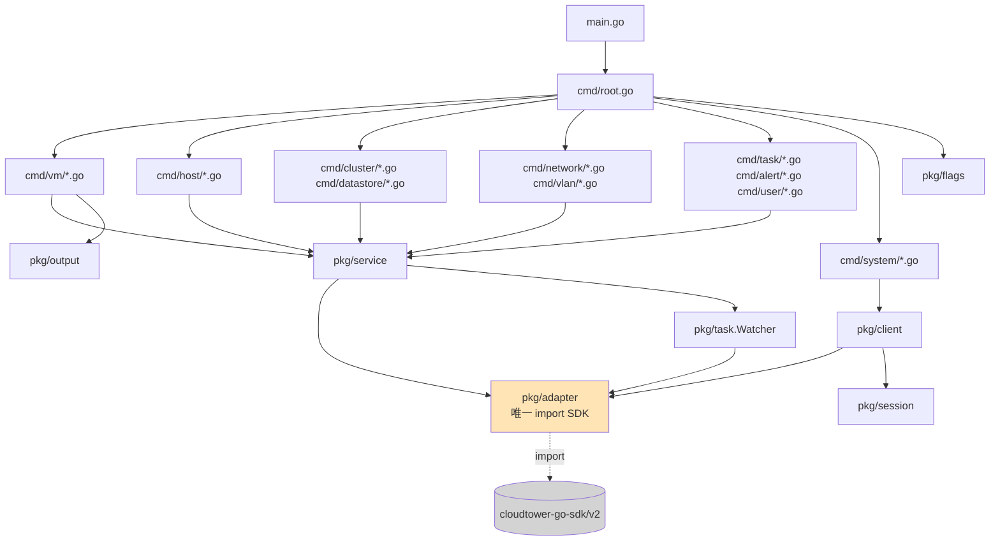

# goct CLI 设计文档

| 字段 | 值 |
| --- | --- |
| 日期 | 2026-04-29 |
| 作者 | liguoqiang (`6547709`) |
| 状态 | Approved（已通过 4 轮澄清确认） |
| 关联文档 | [SPEC.md](../../SPEC.md) · [实施计划 2026-04-29-goct-cli.md](./2026-04-29-goct-cli.md) · [SDK 速查 2026-04-29-sdk-cheatsheet.md](./2026-04-29-sdk-cheatsheet.md) |
| Module | `github.com/6547709/goct` |
| SDK | `github.com/smartxworks/cloudtower-go-sdk/v2` (v2.22.1) |

---

## 1. 问题陈述

SmartX CloudTower 当前主要通过 Web UI 与原始 REST API 进行管理，缺少类似 VMware `govc` 的轻量、无状态、可组合的命令行工具。运维管理员需要：

- **批量自动化**：脚本化执行虚拟机/主机/集群的批量操作。
- **CI/CD 集成**：在流水线中触发资源创建、迁移、快照、备份。
- **快速排障**：在终端直接查询任务、告警、主机状态。
- **JSON 友好**：输出可被 `jq` / `yq` 管道消费。
- **离线鉴权**：避免每次命令都登录，缓存 session token。

`goct` 是这个空缺的填充：模仿 `govc` 的 `noun.verb` 命令风格，通过本地 CLI 完成 CloudTower 95% 的日常运维操作。

---

## 2. 设计原则

| 原则 | 说明 |
| --- | --- |
| **极简动宾** | 命令名采用 `vm.ls` / `host.maintenance.enter` 这种点分式 noun.verb 结构，与 `govc` 完全对齐 |
| **无状态** | 单次命令独立执行，仅 session token 有持久化（XDG cache） |
| **SDK 升级隔离** | 严格三层架构，**仅 `pkg/adapter` 允许 import SDK**；SDK v2→v3 升级时上层零改动 |
| **自动化友好** | 默认 table 输出方便人读，`--json` 透传 SDK 原始结构方便机器读；错误走 stderr，业务走 stdout |
| **错误链完整** | 全部 `fmt.Errorf("...: %w", err)` 包装，保留 `errors.Is/As` 链 |
| **退出码语义化** | 0 成功 / 1 通用错误 / 2 认证失败 / 3 资源不存在 / 4 任务失败 |
| **国际化** | 用户可见输出 100% 英文；代码注释、SPEC、README 中文 |

---

## 3. 范围决策

### 3.1 已澄清的关键决策（4 轮 Q&A）

| # | 问题 | 决策 |
| --- | --- | --- |
| Q1 | go.mod module path | `github.com/6547709/goct` |
| Q2 | SDK 主版本 | `cloudtower-go-sdk/v2`（v2.22.1） |
| Q3 | 第一阶段交付范围 | SPEC 全量三阶段 |
| Q4 | 命令风格 | govc 点分式（`vm.ls`） |
| Q-superpowers | superpowers 应用范围 | 完整 5 阶段流程 |
| Q-branch | 分支策略 | 在 `main` 上开发（仓库无 commit） |
| Q-scope | 总范围 | 管理员运维核心 ≈30 资源（80-100 命令） |
| Q-strategy | 命令实现方式 | 纯手写，每命令独立 .go 文件 |
| Q-delivery | 本次交付节奏 | Tier-1（10 资源 ≈52 命令），Tier-2/3 后续迭代 |

### 3.2 Tier 路线图

CloudTower SDK v2 暴露 130 个资源子包；按管理员运维优先级分三层交付。

#### Tier-1 — 本次交付（核心运维 10 资源 ≈52 命令）

| 资源 | SDK 子包 | 命令 |
| --- | --- | --- |
| **vm** (12) | `client/vm`, `vm_disk`, `vm_nic` | `ls` `info` `create` `clone` `destroy` `migrate` `export` `power.on` `power.off` `power.reset` `power.suspend` `power.resume` |
| **vm.snapshot** (4) | `client/vm_snapshot` | `create` `ls` `revert` `rm` |
| **host** (8) | `client/host`, `discovered_host` | `ls` `info` `maintenance.enter` `maintenance.exit` `shutdown` `reboot` `reconnect` `disconnect` |
| **cluster** (3) | `client/cluster`, `cluster_settings` | `ls` `info` `change` |
| **datastore** (3) | `client/elf_data_store`, `disk` | `ls` `info` `disk.ls` |
| **network** (2) | `client/vds`, `nic` | `ls` `info` |
| **vlan** (4) | `client/vlan` | `ls` `info` `create` `destroy` |
| **task** (4) | `client/task` | `ls` `info` `cancel` `wait` |
| **alert** (3) | `client/alert`, `alert_rule` | `ls` `info` `ack` |
| **user** (4) | `client/user`, `user_role_next` | `ls` `info` `create` `destroy` |
| **系统** (5) | `client/api_info` + login/logout | `about` `version` `session.login` `session.logout` `session.ls` |

**合计 52 命令。**

#### Tier-2 — 下一迭代（运维进阶 ≈10 资源 ≈30 命令）

| 资源 | SDK 子包 | 主要命令 |
| --- | --- | --- |
| `vm.template` | `vm_template`, `content_library_vm_template` | `ls` `info` `create` `clone` `rm` |
| `folder` | `vm_folder` | `ls` `info` `create` `rm` |
| `label` | `label` | `ls` `info` `attach` `detach` `create` `rm` |
| `role` | `user_role_next` | `ls` `info` `create` `rm` |
| `license` | `license`, `ecp_license`, `everoute_license` | `ls` `info` `add` `rm` |
| `backup` | `backup_plan`, `backup_plan_execution`, `backup_restore_*` | `plan.ls/create/run` `restore.ls/run` |
| `replication` | `replication_plan`, `replication_service`, `replica_vm` | `plan.ls/create/run` `vm.ls` |
| `log` | `log_collection`, `log_service_config` | `ls` `download` |
| `audit` | `system_audit_log`, `user_audit_log` | `ls` `info` |
| `iscsi` | `iscsi_target`, `iscsi_lun`, `iscsi_lun_snapshot`, `iscsi_connection` | `target.ls/create/rm` `lun.ls/create/rm` |

#### Tier-3 — 远期（高级网络与扩展能力，≈10 资源 ≈30 命令）

| 资源 | SDK 子包 | 备注 |
| --- | --- | --- |
| `vpc` 全家族 | `virtual_private_cloud_*` (13 子包) | VPC / Subnet / Router / NAT / FloatingIP / SecurityGroup |
| `security` | `security_policy`, `security_group`, `network_policy_rule_service`, `isolation_policy` | Everoute 微分段 |
| `nvmf` | `nvmf_subsystem`, `nvmf_namespace`, `nvmf_namespace_snapshot` | NVMe-oF |
| `gpu` | `gpu_device`, `pci_device` | GPU 直通 |
| `consistency_group` | `consistency_group`, `consistency_group_snapshot` | 一致性组快照 |
| `namespace` | `namespace_group`, `nfs_export`, `nfs_inode` | NFS 命名空间 |
| `observability` | `observability`, `metrics`, `graph`, `view` | 可观测性 |
| `ovf` / `import` | `ovf`, `vm_export_file`, `upload_task` | OVF 导入导出 |
| `topology` | `cluster_topo`, `node_topo`, `rack_topo`, `brick_topo`, `zone_topo` | 拓扑视图 |
| `ipmi` / `ntp` / `smtp` / `snmp` | `ipmi`, `ntp`, `smtp_server`, `snmp_*` | 基础设施配置 |

---

## 4. 架构设计

### 4.1 三层架构（来自 SPEC，加强版）

```
┌─────────────────────────────────────────────────────────┐
│ cmd/  —— Cobra 命令层（仅 flag 绑定 + service 调用）     │
│   - 每命令独立 .go 文件                                   │
│   - 按 noun 分子目录（cmd/vm/, cmd/host/...）            │
│   - register.go 集中挂载到根命令                          │
│   - 严禁 import SDK                                      │
└──────────────────────┬──────────────────────────────────┘
                       │ 调用
┌──────────────────────▼──────────────────────────────────┐
│ pkg/service/  —— 业务编排层                              │
│   - name|id 解析（统一 resolver）                         │
│   - 调 adapter + Watch task 的复合流程                    │
│   - 接收 sub-interface 便于 mock                         │
│   - 严禁 import SDK                                      │
└──────────────────────┬──────────────────────────────────┘
                       │ 调用
┌──────────────────────▼──────────────────────────────────┐
│ pkg/adapter/  —— 防腐层（唯一 import SDK 的位置）         │
│   - Client 聚合接口（内嵌各资源 sub-interface）           │
│   - SDK *models.X → adapter.X 模型转换（去指针、扁平化）   │
│   - SDK 升级仅改本层                                      │
└──────────────────────┬──────────────────────────────────┘
                       │ HTTP
                       ▼
              cloudtower-go-sdk/v2
```

### 4.2 核心组件依赖



### 4.3 关键技术决策

#### D1 — 点分命令路由

**问题**：cobra 默认按空格分子命令树，与 `vm.ls` 含点的命令名直接冲突。

**方案对比**：

| 方案 | 描述 | 优 | 劣 | 选择 |
| --- | --- | --- | --- | --- |
| A | 自定义路由器拦截 `os.Args[1]`，按 `.` split 后分发 | 完全控制 | 绕过 cobra help/completion | ❌ |
| B | cobra 单层平铺，命令名直接含点（`"vm.ls"`） | 与 govc 一致；保留 cobra 全部能力 | 命令较多时根命令树扁平（用 cobra.Group 缓解） | ✅ |
| C | 双映射：内部 `vm ls` cobra 树 + alias `vm.ls` | help 树状直观 | 维护两套别名，命名空间冲突风险 | ❌ |

**决策**：采用 B。每个 cobra.Command.Use 直接为 `"vm.ls"` 等含点字符串，help 输出通过 `cobra.Group{ID:"vm", Title:"Virtual Machines"}` 按 noun 分组。

#### D2 — Adapter 接口分文件 + 内嵌

**问题**：50+ 方法堆在一个 `Client` 接口里，service 层 mock 时需实现全部方法（即使只用一两个）。

**方案**：每资源独立 sub-interface（`VMOps` / `HostOps` / ...），`Client` 主接口内嵌全部 sub-interface。service 层只依赖单一 sub-interface，mock 成本极低。

```go
type Client interface {
    About(ctx context.Context) (TowerInfo, error)
    VMOps; HostOps; ClusterOps; DatastoreOps
    NetworkOps; VLANOps; SnapshotOps
    TaskOps; AlertOps; UserOps
}
```

#### D3 — 通用 name|id 解析器

所有 `info` / `power` / `destroy` 类命令都需把 `<name|id>` 位置参数解析为 ID。统一在 `pkg/service/resolver.go` 提供泛型 `Resolve[T]`，避免每个资源重复 30 行逻辑。

```go
type Lister[T any] func(ctx context.Context, opts ListOpts) ([]T, error)
type IDExtractor[T any] func(T) (id, name string)
func Resolve[T any](ctx context.Context, list Lister[T], extract IDExtractor[T], idOrName string) (T, error)
```

判定规则：UUID 形如 `xxxxxxxx-xxxx-xxxx-xxxx-xxxxxxxxxxxx` → 直接当 ID；否则按 name 模糊查并要求精确匹配 1 个。

#### D4 — Session token 缓存

**路径**：`$XDG_CACHE_HOME/goct/session-<sha1(host+user)>.json`，权限 `0600`，fallback `~/.cache/goct/`。

**逻辑**：

```
NewClient(cfg):
  1. 命中 cache token → 注入 transport Authorization → 直接返回
  2. miss → LoginAndGetToken → 写 cache → 返回
  3. 任何调用 401 → 删除 cache → 重新走 2
```

**好处**：热路径 0 额外 RTT；session 失效自动恢复；支持多 host/user 并存（按 hash 区分）。

#### D5 — Task Watcher

**问题**：变更操作返回 task ID，需轮询 status。

**方案**：

- 底层调 SDK `utils.WaitTask(ctx, client, taskID, 1*time.Second)`，已实现轮询逻辑。
- 上层 `pkg/task.Watcher` 在 TTY 下用 `\r` + 百分比刷新单行（`golang.org/x/term` 检测 TTY）。
- 非 TTY 或 `--format=json` 模式静默，仅输出最终结果。
- 默认超时 300s，可通过 `--task-timeout` 覆盖。
- Ctrl-C 通过 context cancel 优雅退出。

#### D6 — 输出引擎

**接口**：`pkg/output.Render(w io.Writer, data any, format string, columns []Column) error`

- `format=table`（默认）→ tablewriter
- `format=json` → encoding/json MarshalIndent，**透传 SDK 原始 payload**（不二次扁平化，保字段完整性）
- `Column{Header string; Get func(any) string}` 抽象，预定义 `VMListColumns` / `HostListColumns` 等放在 `pkg/output/columns.go`

#### D7 — 配置三级合并

```
ResolvedConfig = merge(
  ~/.goct.yaml,    # lowest
  GOCT_* env vars,
  cmd flags,       # highest
)
```

实现：viper `BindPFlag` + `BindEnv` + `SetConfigFile`，优先级由 viper 自动处理。

#### D8 — 错误处理与退出码

- 所有错误 `fmt.Errorf("operation X: %w", err)` 包装。
- 自定义类型 `var ErrAuth = errors.New("auth failed")` / `ErrNotFound` / `ErrTaskFailed`。
- `cmd/root.go` 中 `cmd.SilenceErrors=true`，由 `errorExit(err)` 统一输出 stderr 并 `os.Exit(code)`：

```
errors.Is(err, ErrAuth)       → exit 2
errors.Is(err, ErrNotFound)   → exit 3
errors.Is(err, ErrTaskFailed) → exit 4
default                       → exit 1
```

---

## 5. 测试策略（TDD 强制）

| 层 | 测试方式 | 覆盖目标 |
| --- | --- | --- |
| `pkg/adapter` | `httptest.Server` mock CloudTower REST API | 200/401/500/超时；每个 SDK 调用契约 |
| `pkg/service` | 手写 fake 实现 sub-interface（每个 sub 仅 ~5 方法） | name→id 解析、错误传播、task 编排 |
| `pkg/task` | mock `adapter.TaskOps`，buffer 断言 | 进度刷新、TTY 检测、超时、取消 |
| `pkg/output` | bytes.Buffer 断言 | table/json 双分支输出格式 |
| `pkg/flags`, `pkg/config`, `pkg/session` | 纯单元测试 | 优先级合并、cache 读写权限 |
| `cmd/*` | cobra `SetArgs` + bytes.Buffer | 命令结构、stdout/stderr、exit code |

**TDD 节奏**：每命令先写失败测试 → 实现到通过 → commit。每个资源完成后跑全量 `go build ./... && go test ./... && go vet ./...`。

---

## 6. 风险与权衡

| 风险 | 影响 | 缓解 |
| --- | --- | --- |
| **SDK API 与文档不一致** | adapter 编码反复返工 | Phase 2 前用 code-explorer 探查全 Tier-1 子包，产出 cheatsheet |
| **130 资源全覆盖工作量** | 一次会话不可能完成 | Tier 分层；本次只做 Tier-1（≈52 命令）；Tier-2/3 写入路线图 |
| **CloudTower task model 异构** | 不同操作的 task 结构差异导致 watcher 处理 corner case | 统一抽象 `TaskRef{ID, EntityID, EntityKind}`；watcher 仅依赖 progress%/status 字段 |
| **自签名证书** | 内部环境必备 `--insecure` | adapter 层 `httptransport.TLSClient(InsecureSkipVerify:true)` 分支已规划 |
| **命令爆炸式增长难以维护** | Tier-2/3 时单层 cobra 树过于扁平 | 已设计 cobra.Group 按 noun 分组；后续可加子命令搜索（`goct help vm`） |
| **测试 fixture 维护成本** | httptest mock 的 JSON fixture 与 SDK 升级不同步 | fixture 集中放 `pkg/adapter/testdata/`，SDK 升级时统一刷新 |
| **跨平台路径差异** | Windows 不支持 0600；XDG cache 仅 Linux 标准 | 仅承诺 macOS/Linux；Windows fallback 到 `%LOCALAPPDATA%\goct\`（Tier-2 再说） |

---

## 7. 非目标（明确排除）

- ❌ Web UI / TUI（goct 是纯 CLI）
- ❌ 多 CloudTower 实例聚合查询（每次只连一个）
- ❌ 资源 YAML manifest（如 kubectl apply）—— 留给后续 `goct apply` 子命令（Tier-3+）
- ❌ Shell completion 自动生成脚本（cobra 默认支持，无需额外工作）
- ❌ Telemetry / 上报
- ❌ 内置教程或交互式引导

---

## 8. 后续阶段触发条件

按 superpowers 工作流，当本设计文档被批准后：

1. → **Phase 2 Writing Plans**：将设计细化为 `docs/plans/2026-04-29-goct-cli.md`，按资源粒度的 task-by-task TDD 计划
2. → **Phase 3 Subagent-Driven Build**：每个资源 1 个 implementer subagent，关键资源（vm/host）追加 spec-reviewer
3. → **Phase 4 Systematic Debugging**：任何 fail 走根因→模式→假设→修复
4. → **Phase 5 Finishing Branch**：4 选项收尾

---

## 9. 附录 A：依赖清单

| 包 | 版本约束 | 用途 |
| --- | --- | --- |
| `github.com/spf13/cobra` | latest | CLI 框架 |
| `github.com/spf13/viper` | latest | 配置三级合并 |
| `github.com/smartxworks/cloudtower-go-sdk/v2` | v2.22.x | CloudTower SDK |
| `github.com/olekukonko/tablewriter` | latest | 表格输出 |
| `github.com/openlyinc/pointy` | latest | 指针辅助（SDK 传递依赖） |
| `golang.org/x/term` | latest | TTY 检测 |
| `github.com/go-openapi/runtime` | SDK 传递 | HTTP transport |

## 10. 附录 B：目录结构（参见实施计划）

详见 [`2026-04-29-goct-cli.md`](./2026-04-29-goct-cli.md)。

---

**审计追踪**

- 2026-04-29 10:30 初稿（基于 4 轮 Q&A 决策）
